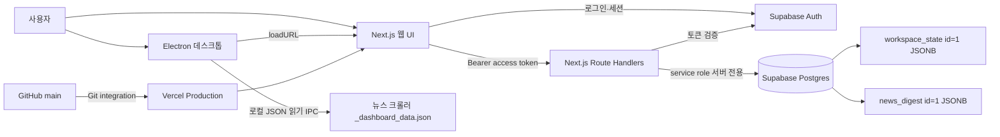
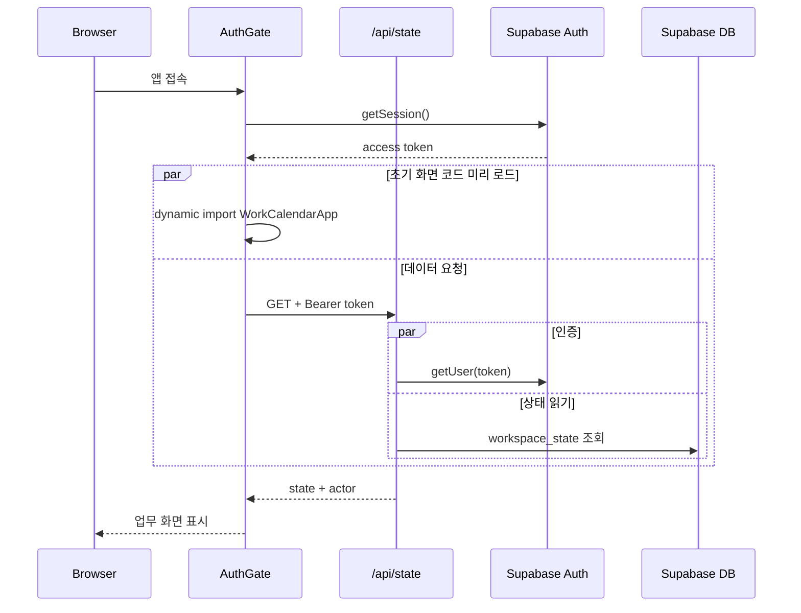

# 스누피가든 업무캘린더 통합 매뉴얼 및 시스템 아키텍처

## 1. 프로그램 개요

이 프로그램은 파크사업팀의 업무, 기간 일정, 반복 루틴, 현장 특이사항, 팀원별 업무량, 관광뉴스와 가입·권한 관리를 한 화면에서 처리하는 내부 협업 도구다.

실제 서비스는 하나의 Next.js 웹 애플리케이션이며, 데스크톱 실행 파일은 Electron 창 안에서 배포된 Vercel 웹 주소를 여는 방식이다. 따라서 웹과 데스크톱은 동일한 화면·API·Supabase 데이터를 사용한다.

## 2. 사용자 매뉴얼

### 로그인과 가입

1. 이메일과 비밀번호로 로그인한다.
2. 계정이 없으면 `새 계정 만들기`를 선택한다.
3. 신규 계정은 Supabase Auth에는 생성되지만 업무 접근 권한은 아직 없다.
4. 관리자가 `설정 > 가입 승인 대기`에서 소속과 권한을 정해 승인한다.
5. 승인된 이메일이 `WorkspaceState.members`에 추가된 이후부터 업무 화면에 들어갈 수 있다.

최초 설치 직후 `admin@local.test` 자리표시자 관리자가 남아 있을 때만 `최초 관리자 설정`이 보인다. 한 번 실제 관리자 계정으로 교체되면 다시 실행할 수 없다.

### 권한 구분

| 권한 | 조회 | 업무·루틴 편집 | 댓글 작성 | 최종 완료 | 삭제·사용자·분류 관리 | 뉴스 관리 |
|---|---:|---:|---:|---:|---:|---:|
| 관리자 `admin` | 가능 | 가능 | 가능 | 가능 | 가능 | 가능 |
| 팀원 `member` | 가능 | 가능 | 가능 | 불가 | 불가 | 불가 |
| 조회·댓글 `commenter` | 가능 | 불가 | 가능 | 불가 | 불가 | 불가 |

화면에서 버튼을 감추는 것에 그치지 않고 `/api/state`가 저장 직전에 권한을 다시 검사한다. 따라서 브라우저 요청을 직접 조작해도 댓글 사용자가 본문을 변경하거나 팀원이 최종 완료를 처리할 수 없다.

### 일반적인 업무 흐름

1. `새 업무`에서 제목, 시작일, 종료일, 담당자, 분류, 유형, 우선순위, 설명, 체크리스트를 등록한다.
2. 업무 상태는 `예정 → 진행 중 → 완료 요청 → 최종 완료` 순서로 진행한다.
3. 팀원은 `완료 요청`까지만 처리하며 관리자가 알림 탭에서 승인하거나 반려한다.
4. 여러 날에 걸친 업무는 캘린더에서 Google Calendar의 종일 일정처럼 날짜 셀 위를 가로지르는 막대로 표시된다.
5. 현장의 간단한 이슈는 특이사항으로 먼저 남기고, 필요하면 정식 업무로 전환한다.
6. 반복 작업은 루틴으로 정의하고 캘린더 자동 표시 또는 `오늘 실행`으로 실제 업무를 만든다.

### 저장과 새로고침

- 화면 상태가 바뀌면 500ms 동안 추가 변경을 기다린 뒤 자동 저장한다.
- 먼저 브라우저 `localStorage`에 사용자 이메일별 오프라인 복사본을 기록한다.
- 이어서 `PUT /api/state`로 서버 상태와 병합하여 Supabase에 저장한다.
- 네트워크 오류가 나면 로컬 사본은 남고, 다음 접속 때 서버 상태와 합친다.
- 삭제 항목은 `deletedIds` tombstone에 기록하여 다른 오래된 클라이언트가 다시 살려내지 못하게 한다.
- `전체 새로고침` 또는 캘린더의 `새로고침`은 현재 로컬 상태와 서버 상태를 다시 병합한다.

## 3. 전체 시스템 구조



### 요청 수명 주기



## 4. GitHub·Vercel·Supabase 계정 및 프로젝트 연결

### 현재 확인된 연결 정보

| 구분 | 연결 식별자 | 확인 위치 | 비고 |
|---|---|---|---|
| GitHub 원격 소유자 | `sngardenmanager-oss` | `git remote -v` | 저장소 소유 계정 또는 조직 |
| GitHub 저장소 | `sngardenmanager-oss/task` | origin URL | `main` 푸시 대상 |
| 로컬 커밋 작성자 | `Snoopy Garden Manager` | `git config user.name` | GitHub 로그인 계정과 별개인 커밋 메타데이터 |
| 로컬 커밋 이메일 | `sn.gardenmanager@gmail.com` | `git config user.email` | Git 로그에 기록되는 이메일 |
| GitHub CLI 저장 계정 | `sngardenmanager-oss` | `gh auth status` | 2026-09-10 확인 시 CLI 토큰은 만료/무효. Git push 인증은 Windows Git 자격 증명과 별도로 동작 가능 |
| Vercel 팀/소유 범위 | `pig15` | 배포 상세 URL 경로 | Vercel CLI의 `whoami`는 현재 한글 ByteString 오류로 표시 실패 |
| Vercel 프로젝트 | `snoopy-work-calendar` | `.vercel/project.json` | 단일 프로젝트 링크 |
| Vercel Project ID | `prj_1jHHaBxcKXFSAr8jv6FCRnGTucmw` | `.vercel/project.json` | 비밀키가 아닌 프로젝트 식별자 |
| Vercel Org ID | `team_wcmSxncaP5C3Wvgw3ESqUTqV` | `.vercel/project.json` | `pig15` 범위에 연결된 식별자 |
| 운영 주소 | `https://snoopy-work-calendar-pig15.vercel.app` | `desktop/site-url.json` | Electron도 이 주소를 연다 |
| Supabase 프로젝트 ref | `esuqbekugdnpiqfopjsx` | Supabase URL | 프로젝트 URL은 `https://esuqbekugdnpiqfopjsx.supabase.co` |
| Supabase 소유 계정 | 저장소에서 확인 불가 | Supabase Dashboard 필요 | 코드에는 프로젝트 ref만 있고 소유자의 이메일은 저장하지 않음 |

### 실제 연결 사슬

```text
로컬 Git 작성자: Snoopy Garden Manager <sn.gardenmanager@gmail.com>
        │ git push
        ▼
GitHub: sngardenmanager-oss/task, main 브랜치
        │ Vercel Git Integration
        ▼
Vercel 범위: pig15 / 프로젝트: snoopy-work-calendar
        │ Production 환경변수
        ▼
Supabase 프로젝트: esuqbekugdnpiqfopjsx
        ├─ Auth 사용자
        ├─ public.workspace_state
        └─ public.news_digest
```

### 계정과 자격 증명의 차이

- Git의 `user.name`과 `user.email`은 커밋 작성자 표시일 뿐 로그인 토큰이 아니다.
- `git push`는 Windows Git Credential Manager의 GitHub 자격 증명을 사용할 수 있다.
- `gh` CLI는 별도 토큰 저장소를 사용하므로 Git push가 성공해도 `gh auth status`가 실패할 수 있다.
- Vercel의 프로젝트 연결 정보는 `.vercel/project.json`에 있지만 로그인 토큰은 저장소에 커밋하지 않는다.
- Supabase 브라우저 키는 공개 가능한 publishable/anon 키이고, service role/secret 키는 반드시 Vercel 서버 환경변수에만 둔다.

## 5. 런타임 기술 스택

| 영역 | 기술 | 역할 |
|---|---|---|
| 웹 프레임워크 | Next.js 16 App Router | 정적 첫 페이지와 동적 API Route Handler |
| UI | React 19, TypeScript, Tailwind CSS | 상태 기반 화면, 반응형 레이아웃 |
| 컴포넌트 | shadcn 계열 UI, Base UI, Lucide | 버튼·모달·아이콘 |
| 인증·DB | Supabase Auth + Postgres JSONB | 세션, 가입 사용자, 공유 데이터 저장 |
| 데스크톱 | Electron 44, electron-builder | Vercel 웹을 Windows 실행 파일로 감쌈 |
| 엑셀 | ExcelJS 동적 import | 대량 등록 템플릿 생성과 xlsx 파싱 |
| 테스트 | Playwright, oxlint, TypeScript build | 핵심 사용자 흐름과 정적 검사 |
| 배포 | GitHub → Vercel Git Integration | main 푸시 시 Production 배포 |

`vite.config.ts`, `db/index.ts`, Drizzle D1/SQLite 설정과 Cloudflare Workers 패키지는 초기 Sites/Vinext 템플릿 흔적이다. 현재 Vercel 운영 경로에서는 사용되지 않는다. `app/chatgpt-auth.ts`도 현재 로그인 화면에서 import되지 않는 예비 모듈이다. `GEMINI_API_KEY` 역시 환경변수에는 남아 있지만 현재 관광뉴스 구현은 AI 요약을 사용하지 않는다.

## 6. 핵심 데이터 모델

`lib/types.ts`가 웹, API, 저장 계층이 함께 사용하는 계약이다.

| 타입 | 핵심 필드 | 의미 |
|---|---|---|
| `Member` | id, name, email, role, team, active | 승인된 업무 사용자 |
| `Category` | id, name, color, active | 업무·루틴·특이사항 공통 분류 |
| `Task` | date, endDate, assigneeId, priority, status, checklist, comments | 단일/기간 업무와 상태 워크플로 |
| `Routine` | cadence, nextDate, checklist, referenceLinks, active | 반복 일정 정의 |
| `SpecialNote` | date, location, urgent, completed, comments, convertedTaskId | 현장 특이사항과 업무 전환 연결 |
| `NewsItem` | title, category, source, collectedAt, url | 최근 관광뉴스 제목·원문 |
| `WorkspaceState` | members, categories, tasks, routines, notes, deletedIds | 공유 업무 상태 전체 |

현재 Supabase 저장 구조는 다음 두 행으로 분리되어 있다.

- `workspace_state`: `id=1`, `payload JSONB`, 업무 전체 상태
- `news_digest`: `id=1`, `items JSONB`, 최근 뉴스 목록

뉴스를 별도 행으로 분리했기 때문에 약 1천 건의 뉴스가 일반 업무 자동저장 payload에 섞이지 않는다. 다만 업무 자체는 아직 하나의 JSONB blob이므로 데이터가 매우 커지면 tasks, comments, notes를 관계형 테이블로 나누는 2차 마이그레이션이 필요하다.

## 7. API 목록

| API | 메서드 | 권한 | 역할 |
|---|---|---|---|
| `/api/state` | GET | 승인 사용자 | 전체 상태와 현재 actor 반환 |
| `/api/state` | PUT | 역할별 검증 | 병합, 삭제 tombstone 적용, 저장 |
| `/api/auth/bootstrap` | GET/POST | 최초 1회 | 자리표시자 관리자를 실제 Auth 계정으로 교체 |
| `/api/auth/registrations` | GET/PATCH | 관리자 | 미승인 Auth 사용자 조회와 멤버 승인 |
| `/api/news?limit=10` | GET | 승인 사용자 | 첫 화면용 최근 뉴스 일부 |
| `/api/news` | GET | 승인 사용자 | 뉴스 탭 전체 목록 |
| `/api/news` | POST/PATCH/DELETE | 관리자 | 수동 뉴스 추가·수정·삭제 |
| `/api/news/digest` | POST | 관리자 | Electron이 읽은 크롤러 데이터를 검증 후 교체 |

모든 업무/뉴스 API는 `Authorization: Bearer <Supabase access token>`을 받고 서버에서 `supabase.auth.getUser(token)`으로 다시 검증한다. 캐시 헤더는 개인 데이터 보호와 최신 상태 유지를 위해 `private, no-store`다.

## 8. 프런트엔드 공통 동작

### 초기 로딩 최적화

- `AuthGate`가 Supabase 세션을 먼저 확인한다.
- 세션이 있으면 `WorkCalendarApp` 코드의 dynamic import와 `/api/state` 요청을 동시에 시작한다.
- ExcelJS는 설정에서 양식 생성/업로드를 누를 때만 import한다.
- 뉴스는 첫 화면에서 10건만 받고 뉴스 탭 진입 시 전체를 지연 로딩한다.
- 업무 검색은 `useDeferredValue`, 파생 목록은 `useMemo`를 사용한다.

### 화면 이동과 모달

- URL 경로를 탭마다 나누지 않고 `view` 상태로 화면을 바꾼다.
- `history.pushState`에 view, modal, 선택한 업무·루틴·날짜를 저장한다.
- 브라우저/Android 뒤로가기는 모달을 먼저 닫고 이전 화면 상태를 복원한다.
- 데스크톱과 모바일은 같은 view를 공유하며 사이드바와 하단 5개 메뉴만 다르게 렌더링한다.

### 링크 처리

- 설명과 체크리스트의 `http/https` 문자열은 `LinkifiedText`가 클릭 링크로 바꾼다.
- 웹에서는 새 탭으로 연다.
- Electron에서는 `setWindowOpenHandler`가 새 창을 막고 운영체제 기본 브라우저로 전달한다.

## 9. 개발·빌드·배포 운영 절차

### 로컬 웹

```powershell
npm.cmd install
npm.cmd run dev
```

브라우저에서 `http://localhost:3000`으로 접속한다. `.env.local`에 Supabase 공개 키와 서버 비밀키가 있어야 실제 Auth/DB를 사용한다.

### 품질 검사

```powershell
npm.cmd run lint
npm.cmd run build
```

Playwright E2E는 인증이 없는 단순 환경과 현재 보안 API 구성이 맞지 않을 수 있으므로 테스트용 인증/fixture를 별도로 준비한 뒤 실행하는 것이 안전하다.

### 데스크톱 빌드

```powershell
npm.cmd run desktop:build
```

출력은 `desktop-dist/스누피가든-업무캘린더-0.1.0.exe`다. `desktop/site-url.json`의 URL을 열며, 개발 시에는 `SNOOPY_CALENDAR_URL`로 덮어쓸 수 있다.

### 운영 배포

```powershell
git add <변경 파일>
git commit -m "변경 내용"
git push origin main
```

Vercel Git Integration이 `sngardenmanager-oss/task`의 `main` 푸시를 감지해 `snoopy-work-calendar` Production을 빌드한다. 환경변수나 DB 마이그레이션 변경은 Git 푸시만으로 해결되지 않으므로 각각 Vercel/Supabase Dashboard에서 별도로 반영한다.

## 10. 환경변수 이름

문서에는 값 대신 필요한 이름만 기록한다.

- 브라우저: `NEXT_PUBLIC_SUPABASE_URL`, `NEXT_PUBLIC_SUPABASE_PUBLISHABLE_KEY` 또는 `NEXT_PUBLIC_SUPABASE_ANON_KEY`
- 서버: `SUPABASE_SERVICE_ROLE_KEY` 또는 `SUPABASE_SECRET_KEY`
- 선택 호환값: `SUPABASE_URL`, `SUPABASE_PUBLISHABLE_KEY`, `SUPABASE_ANON_KEY`
- 마스터 관리자: `MASTER_EMAILS`
- Electron 주소: `SNOOPY_CALENDAR_URL`
- 뉴스 폴더: `SNOOPY_NEWS_FOLDER`

서비스 역할 키, JWT secret, DB password, Vercel token은 절대 `NEXT_PUBLIC_` 접두사를 붙이거나 Git에 커밋하지 않는다.

## 11. 현재 한계와 확장 우선순위

1. `app/work-calendar-app.tsx`가 약 5,400줄인 단일 Client Component다. 탭별 파일과 공통 hooks로 분리하면 수정과 번들 분할이 쉬워진다.
2. `workspace_state` 단일 JSONB는 현재 규모에서는 단순하고 충돌 병합이 쉽지만, 데이터가 계속 누적되면 네트워크·직렬화 비용이 증가한다.
3. `deletedIds`는 자동 정리되지 않는다. 관계형 테이블 전환 전이라도 오래된 tombstone 정리 정책이 필요하다.
4. 저장 병합은 항목 id 단위이며 동일 항목을 두 사용자가 동시에 수정하면 마지막으로 도착한 객체가 우선될 수 있다. 필드별 버전 또는 `updatedAt` 기반 충돌 검사가 없다.
5. 루틴 주기는 한국어 문자열 정규식으로 판정한다. 복잡한 요일 조합, 공휴일, 말일 규칙은 별도 recurrence 모델이 필요하다.
6. 설정의 수동 사용자 추가는 `members`만 만들고 Supabase Auth 사용자를 만들지 않는다. 실제 로그인 계정은 `가입 신청 → 관리자 승인` 경로를 권장한다.
7. Supabase RLS는 켜져 있지만 서버 service role이 실제 DB 접근을 담당한다. 브라우저가 테이블을 직접 읽지 않도록 현재 구조를 유지해야 한다.

## 12. 주요 소스 파일 지도

| 파일 | 책임 |
|---|---|
| `app/page.tsx` | 앱 진입점, `AuthGate` 렌더링 |
| `app/auth-gate.tsx` | 세션, 로그인, 가입, 최초 관리자, 초기 로딩 |
| `app/work-calendar-app.tsx` | 9개 탭, 공통 상태, 자동저장, 폼과 상세 모달 |
| `lib/types.ts` | 전체 데이터 타입 계약 |
| `app/api/state/route.ts` | 상태 병합, 권한 검증, 저장 |
| `lib/workspace-store.ts` | `workspace_state` 읽기·쓰기 |
| `lib/news-store.ts` | `news_digest` 읽기·쓰기 |
| `lib/auth-server.ts` | Bearer 인증과 멤버 권한 판정 |
| `desktop/main.cjs` | Electron 창, 뉴스 JSON 읽기, 외부 링크, smoke test |
| `desktop/preload.cjs` | 안전한 IPC 브리지 |
| `supabase/migrations/*.sql` | 운영 Supabase 테이블 정의 |
| `tests/e2e/work-calendar.spec.ts` | 주요 화면 흐름 회귀 테스트 |

## 13. 탭별 상세 문서

- [오늘](./01_오늘_탭.md)
- [캘린더](./02_캘린더_탭.md)
- [전체 업무](./03_전체_업무_탭.md)
- [루틴 관리](./04_루틴_관리_탭.md)
- [특이사항](./05_특이사항_탭.md)
- [팀 현황](./06_팀_현황_탭.md)
- [관광뉴스](./07_관광뉴스_탭.md)
- [설정](./08_설정_탭.md)
- [알림](./09_알림_탭.md)
- [공통 기능·인증·저장·배포 재사용](./10_공통_기능_인증_저장_배포_재사용_가이드.md)
