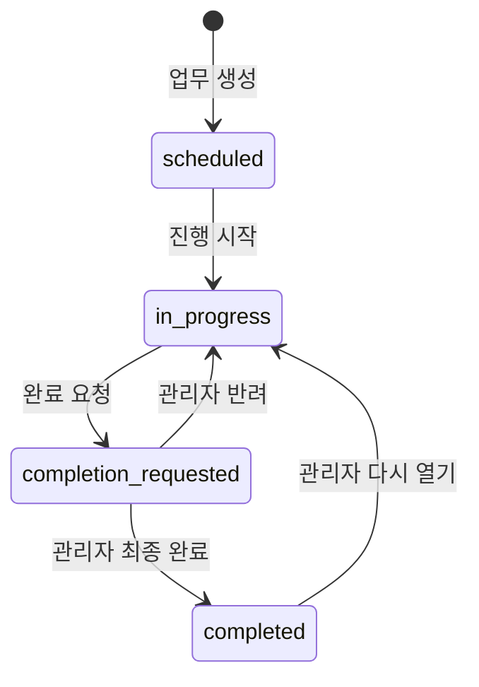

# 전체 업무 탭 구현 문서

## 목적

모든 업무를 검색하고 상태·담당자 기준으로 좁힌 뒤 날짜순으로 확인하는 목록 화면이다. 각 항목에서 업무 상세, 체크리스트, 댓글, 수정, 상태 워크플로를 연결한다.

## 관련 코드

- 화면: `TasksView`
- 공통 검색 계산: `visibleTasks`
- 목록 카드: `TaskCard`
- 상세: `TaskDetail`
- 생성: `TaskForm`
- 수정: `EditTaskForm`
- 상태 변경: `setTaskStatus`
- 체크: `toggleChecklist`
- 댓글: `TaskDetail.submitComment`, 부모의 `addComment`, `deleteTaskComment`
- 삭제: `deleteTask`
- 자동저장: `updateData` 이후 data 감시 `useEffect`

## 검색과 필터

검색어는 `search.trim().toLowerCase()`를 `useDeferredValue`로 늦춰 대량 목록에서 입력 반응을 우선한다.

업무는 다음 조건을 모두 만족해야 표시된다.

```ts
title 또는 description에 검색어 포함
AND statusFilter와 상태 일치 또는 all
AND assigneeId/협업자에 memberFilter 포함 또는 all
```

`visibleTasks`는 `useMemo`로 캐시하며 `TasksView`에서 시작일 오름차순으로 정렬해 `TaskCard`를 렌더링한다.

## 업무 생성 모델

`TaskForm`은 다음 입력을 받는다.

- 필수: 업무명, 시작일, 담당자, 분류
- 선택: 종료일, 유형, 우선순위, 설명, 체크리스트
- 유형: 일반 업무, 루틴 업무, 현장 이슈, 행사·프로젝트
- 체크리스트: textarea의 한 줄을 한 항목으로 변환하고 각각 id와 `done=false`를 부여

종료일이 시작일보다 빠르면 저장하지 않는다. 댓글, 체크리스트, 생성자와 생성 시각을 포함한 완전한 `Task` 객체를 만든 뒤 `data.tasks`에 추가한다.

## 업무 수정

`EditTaskForm`은 기존 객체를 펼친 뒤 변경 가능한 필드만 덮어쓴다. 체크리스트는 같은 인덱스의 기존 문구와 동일하면 기존 id와 완료 상태를 유지하고, 문구가 바뀌면 새 항목으로 취급해 `done=false`로 초기화한다.

## 상태 머신



- 팀원은 예정→진행→완료 요청까지 가능하다.
- 관리자는 모든 전환과 최종 완료, 다시 열기를 할 수 있다.
- 댓글 사용자는 상태를 바꿀 수 없다.
- `/api/state`는 비관리자가 새로 `completed` 상태를 만드는 요청을 거절한다.

## 상세 모달

`TaskDetail`은 다음을 한곳에서 제공한다.

- 시작·종료일, 분류, 담당자, 상태, 우선순위, D-day
- 설명 속 URL 자동 링크
- 체크리스트 완료 토글
- 댓글 목록과 작성
- 관리자의 댓글 삭제
- 편집, 삭제, 상태 전환 버튼

업무 삭제는 관리자만 가능하고, 배열에서 제거하는 동시에 `deletedIdsRef`에 id를 추가한다. 이 tombstone은 서버 병합 시 다른 클라이언트의 오래된 복사본이 삭제한 업무를 되살리는 것을 막는다.

## 저장 흐름

```text
사용자 조작
  → setData/updateData로 메모리 상태 즉시 반영
  → 500ms debounce
  → localStorage 오프라인 사본 저장
  → PUT /api/state
  → 서버 id 단위 병합 + 권한 검사
  → workspace_state JSONB upsert
  → 병합 결과를 다시 클라이언트에 적용
```

## 재사용 방법

다른 프로그램으로 옮길 때는 UI보다 먼저 다음 도메인 조각을 복사한다.

1. `Task`, `TaskStatus`, `Comment` 타입
2. 상태 머신과 역할별 transition guard
3. `TaskForm`/`EditTaskForm`의 입력→객체 변환
4. `TaskDetail`의 체크리스트·댓글 composition
5. 검색/필터 selector
6. 저장 adapter

저장소를 Supabase 대신 REST, Firebase, SQLite로 바꾸려면 UI가 직접 fetch하지 않도록 `TaskRepository` 인터페이스를 먼저 만드는 것이 좋다.

## 주의할 점

- 현재 `TasksView`는 전달받은 배열에 `.sort()`를 직접 호출한다. 재사용 버전에서는 `[...tasks].sort()`로 복사 후 정렬하는 편이 안전하다.
- 동시 편집은 id 단위 객체 병합이므로 같은 업무를 두 사람이 수정하면 필드 단위 충돌 해결이 없다.
- 협업자는 검색 필터에는 포함되지만 팀 현황의 진행 업무 수에는 주담당자만 포함된다.
- `deletedIds`는 계속 누적되므로 장기 운영 시 정리 정책 또는 관계형 삭제 모델이 필요하다.
