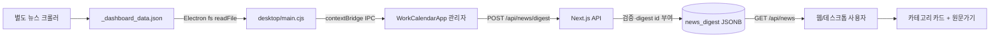

# 관광뉴스 탭 구현 문서

## 목적

별도 뉴스 크롤러가 모은 기사 중 최근 3개 서울 달력 날짜의 데이터를 카테고리별로 묶어 보여준다. MD 문서 본문을 표시하거나 링크를 추측하지 않고 크롤러 JSON에 저장된 기사 제목과 원문 URL을 그대로 사용한다.

## 전체 데이터 흐름



## 관련 코드

- 로컬 읽기: `desktop/main.cjs`의 `collectRecentNewsItems`
- IPC main: `news:collect-recent`, `news:mark-synced`
- IPC preload: `desktop/preload.cjs`
- 브라우저 타입: `lib/types.ts`의 `Window.snoopyDesktop`
- 자동 업로드: `WorkCalendarApp`의 관리자 desktop `useEffect`
- 최초 10건: `/api/news?limit=10`
- 전체 lazy load: `loadAllNews`
- 자동 동기화 API: `app/api/news/digest/route.ts`
- 수동 CRUD API: `app/api/news/route.ts`
- 저장: `lib/news-store.ts`
- 화면: `groupNewsByCategory`, `NewsView`

## 로컬 원본

기본 폴더는 다음과 같다.

```text
C:\Users\hanji\Documents\한지원 저장소\뉴스크롤링\뉴스모음
```

읽는 파일은 `_dashboard_data.json`이다. `SNOOPY_NEWS_FOLDER` 환경변수로 다른 폴더를 지정할 수 있다.

JSON의 최상위 key가 카테고리이고 값은 기사 배열이다. 각 기사에서 다음 필드를 사용한다.

| 원본 필드 | 앱 필드 |
|---|---|
| title | title |
| url | url |
| press 또는 source | source |
| pub_date 앞 10자 | collectedAt |
| 최상위 key | category |

## 최근 3일 판정

Electron은 현재 시각에 UTC+9시간을 더해 서울 달력의 오늘·어제·그제 `YYYY-MM-DD` Set을 만든다. rolling 72시간이 아니라 달력 날짜 3개이므로 그제 00:00 기사도 포함된다.

화면도 `dayDifference(item.collectedAt, isoDate())`가 0~2인 항목만 표시한다.

## id와 중복

자동 수집 id는 `SHA-1(category + ':' + (url || title))`이다. 같은 URL이 서로 다른 카테고리에 포함되면 카테고리별 id가 달라 둘 다 표시된다. 서버는 앞에 `digest-`를 붙여 자동 수집 항목임을 구분한다.

수동 등록 항목은 `digest-` 접두사가 없다. 다음 자동 동기화 때 서버는 기존 자동 항목을 새 목록으로 교체하고 수동 항목은 보존한다.

## 동기화 최적화

Electron은 다음 값을 snapshot id로 사용한다.

```text
배포 appUrl : 원본 파일 size : 원본 파일 mtimeMs
```

성공한 snapshot은 Electron `userData/news-source-sync.json`에 저장한다. 다음 실행에서 같으면 11MB JSON 파싱과 약 1천 건 업로드를 모두 건너뛴다. 서버 POST가 성공한 뒤에만 `markNewsSynced`를 호출하므로 실패한 업로드가 완료로 기록되지 않는다.

## 서버 검증

`POST /api/news/digest`는 다음을 확인한다.

- 요청자가 승인된 관리자
- items가 배열
- id, title, category가 문자열이고 비어 있지 않음
- pubDate가 `YYYY-MM-DD`
- 최대 5,000건
- URL protocol이 http 또는 https

서버 service role로 `news_digest`의 `id=1` 행을 upsert한다.

## 화면 렌더링

`groupNewsByCategory`는 Map으로 그룹을 만든다.

- 카테고리 내부: 날짜 최신순
- 카테고리 순서: 기사 수 내림차순
- 화면: 큰 화면 2열, 작은 화면 1열
- 카드 높이: `max-h-48`, 초과 기사는 내부 스크롤
- 각 행: 순번, 한 줄 제목, `원문가기`
- 많은 카드: `content-visibility:auto`로 화면 밖 렌더 비용 절감

웹에서는 새 탭, Electron에서는 운영체제 기본 브라우저로 원문을 연다.

## 수동 뉴스 기능

관리자는 MD/TXT 파일도 수동으로 가져올 수 있다. 이 기능은 문서 내용을 화면에 출력하지 않는다.

- 첫 `# 제목` 또는 파일명을 title로 사용
- 첫 http/https 문자열을 url로 사용
- category는 `직접 등록`
- 등록일은 오늘

관리자는 화면에서 제목, 카테고리, 출처, 날짜, URL을 수정하거나 항목을 삭제할 수 있다.

## 재사용 방법

다른 프로젝트에서는 다음 interface를 경계로 분리한다.

```ts
type ArticleSource = {
  getSnapshotId(): Promise<string>;
  getRecentArticles(days: number): Promise<NewsItem[]>;
};

type NewsRepository = {
  replaceAutomated(items: NewsItem[]): Promise<void>;
  list(options?: { limit?: number }): Promise<NewsItem[]>;
};
```

Electron 대신 백엔드 cron, NAS 폴더 watcher, RSS 수집기로 바꾸더라도 UI와 저장 API는 유지할 수 있다.

## 주의할 점

- 웹 브라우저만으로는 사용자 PC의 임의 파일 경로를 읽을 수 없다. 자동 수집은 Electron 관리자 실행이 필요하다.
- source 파일이 바뀌지 않으면 재동기화하지 않는다. 날짜가 지나면 화면 필터로 오래된 기사는 자동으로 사라진다.
- 현재 `news_digest`도 단일 JSONB 행이지만 최근 3일 자동 목록으로 계속 교체되므로 일반 업무 데이터처럼 무한 증가하지 않는다.
- 원문 사이트가 URL을 폐기하거나 로그인을 요구하는 문제는 앱이 통제할 수 없다.
