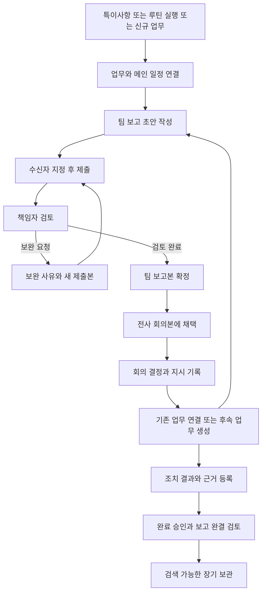

# 스누피가든 업무프로그램 보고체계와 연결 업무 고도화 기획서

작성일: 2026년 10월 4일

문서 버전: 1.0 제안안

검토 대상: 현재 로컬 `snoopy-work-calendar` 소스와 기존 기능 문서
대상 독자: 운영 책임자, 팀 관리자, 보고 담당자, 개발 담당자

이 기획서는 현재 업무캘린더의 전체 기능을 바탕으로, **업무가 시작된 이유부터 보고 내용, 검토 의견, 의사결정, 후속 조치와 최종 결과까지 이어서 확인할 수 있는 운영 기록 체계**를 제안한다. 기존 캘린더와 연결 업무 구조를 유지하고, 업무 상세와 보고서에 기록 조회 기능을 확장하는 방향이다.

핵심 개선은 보고 당시 내용을 고정해 보존하고, 그 보고에서 나온 결정과 후속 업무를 연결하며, 시간이 지나도 같은 기록을 검색하고 재출력할 수 있게 만드는 것이다. 단순히 기록을 많이 남기는 것보다 **누가, 언제, 무엇을, 누구에게 보고했고, 어떤 판단으로 무엇이 바뀌었는지**를 명확하게 남기는 데 중점을 둔다.

이번 산출물은 기획서 한 파일이다. 프로그램 코드 수정, 데이터 변경, 빌드와 배포는 포함하지 않는다. 아래의 ‘현재’는 로컬 코드에서 확인한 구현 범위이며 운영 서버 적용 여부를 의미하지 않는다. ‘제안’은 앞으로 개발할 사항이다.

## 1 추진 목표와 운영 원칙

고도화 후에는 업무 하나를 열어 발생 경위, 담당자와 일정 변경, 관련 보고서, 결정 내용, 후속 업무, 완료 근거를 확인할 수 있어야 한다. 보고서를 열면 당시 보고 내용과 현재 진행 상황을 각각 볼 수 있어야 한다.

| 목표 | 사용자가 확인할 수 있어야 하는 내용 |
| --- | --- |
| 보고 책임 명확화 | 작성자, 제출자, 수신자, 검토자, 최종 확정자와 각 처리 시각 |
| 당시 내용 보존 | 보고한 시점의 업무 상태, 담당자, 일정, 수치, 근거 자료 |
| 변경 과정 추적 | 무엇이 바뀌었는지, 누가 바꿨는지, 왜 바꿨는지 |
| 실행과 보고 연결 | 보고 항목에서 원본 업무로, 결정에서 후속 업무로 이동 |
| 연결 업무 가시성 | 메인과 하위 일정, 선행과 후속 업무, 지연의 영향을 함께 확인 |
| 장기 재사용 | 과거 행사, 이슈 대응, 의사결정을 검색해 다음 운영에 활용 |

운영 원칙은 다음과 같다.

1. 업무 원본은 현재 실행 상황을 관리하고, 제출·확정 보고본은 당시 상황을 보존한다.
2. 댓글, 공식 보고, 검토 의견, 결정, 완료 승인은 서로 구분해 기록한다.
3. 확정본은 덮어쓰지 않는다. 정정은 사유가 있는 새 버전으로 남긴다.
4. 같은 업무를 여러 보고서에 올려도 원본 업무를 중복 생성하지 않는다.
5. 사용자는 핵심 내용을 한 번 입력하고, 작성자·시각·연결 정보는 시스템이 기록한다.
6. 업무 상태와 보고 처리 상태를 분리한다. 보고서 확정만으로 업무가 완료되지 않는다.
7. 과거에 남기지 않은 보고·승인 이력은 추정해서 만들지 않는다.

## 2 현재 프로그램의 전체 구성과 확장 방향

현재 프로그램은 업무, 일정, 루틴, 현장 특이사항, 팀 현황, 관광뉴스, 주간보고서와 전사 관제를 연결하는 내부 업무 도구다. 웹과 Electron 데스크톱 실행 경로가 있고, Android용 프로젝트와 패키징 구성도 존재한다. 실제 기기별 사용 가능 여부는 후속 개발 시 별도 확인한다.

| 영역 | 현재 구현 또는 구성 | 고도화에서 추가할 내용 |
| --- | --- | --- |
| 로그인과 가입 승인 | 계정 인증, 가입 승인, 사용자 활성 상태와 역할 관리 | 보고 역할 지정과 변경 이력, 퇴사자 기록의 이름 보존 |
| 팀별 작업공간 | 팀별 업무·보고서 분리, 소속에 따른 접근, 마스터 팀 전환 | 팀별 보고 경로와 마감일, 보고 제출 현황 |
| 오늘 | 당일 업무와 주요 상태 확인, 업무 상세 진입 | 오늘 제출할 보고, 내 검토 대기, 후속 조치 기한 표시 |
| 캘린더 | 월·주 일정, 기간 업무, 업무 시간, 루틴, iCal 내보내기와 구독 | 보고 마감과 회의 일정 연결, 선택한 업무의 연결 관계 강조 |
| 전체 업무 | 검색·필터, 담당자·협업자·분류·유형·우선순위·체크리스트·댓글 | 보고 필요 여부, 최근 보고일, 원본 변경 알림, 기록 타임라인 |
| 메인과 하위 일정 | 1단계 하위 일정, D-day 기준 일정, 진행률·지연, 템플릿 | 보고서에 프로젝트 요약 포함, 보고 당시 진행률 보존 |
| 업무 연결 | 먼저 할 일, 다음에 할 일, 관련 업무, 연결 해제 기록 | 관계도, 지연 영향 표시, 연결 변경 사유, 과거 관계 조회 |
| 루틴 관리 | 반복 일정, 체크리스트·참고 링크, 오늘 실행, 중단·재시작 | 실행 회차별 보고·결과 연결, 반복 이슈 검색 |
| 특이사항 | 현장 위치·긴급 여부·댓글, 처리 완료와 보관, 업무 전환 | 발견부터 조치까지 연결, 보고 필요 표시, 완료 근거 |
| 팀 현황 | 담당자별 업무와 상태 집계 | 보고 미제출, 검토 대기, 결정 대기, 후속 조치 지연 집계 |
| 관광뉴스 | 로컬 수집 자료 반영과 수동 관리, 원문 링크, 보고서 뉴스 선택 | 보고에 사용한 출처와 기준 시점 보존, 관련 안건 연결 |
| 팀 보고서 | 실적·계획, 수동 행, 특이사항, 안건, 뉴스, 미완결 이월 | 제출·검토·보완 절차, 수신자, 버전 비교, 공식 보고 기록 |
| 경영 지표 | 일자별 통계와 입도객 자료, 업로드·되돌리기, 비교 계산 | 수치 정정 이유, 검토자, 확정본에서 사용한 자료 버전 추적 |
| 안건과 후속 업무 | 단순 보고·결정 요청·지시 후속 안건, 결정 입력, 후속 업무 등록 | 결정자·결정일, 복수 조치, 조치별 완료 기준과 결과 확인 |
| 보고 보관과 출력 | 확정본, 수정본, Excel·PDF·인쇄, 외부 보관 링크 | 장기 검색, 버전·확정자 표시, 연결 기록을 포함한 출력 |
| 알림과 완료 요청 | 완료 요청 목록, 관리자 승인·반려, 마스터 저장 용량 알림 | 제출·보완·재제출·결정·기한 초과 알림과 처리 기록 |
| 마스터 전체 팀 | 오늘·캘린더·전체 업무·팀 현황·완료 요청 통합 조회 | 팀별 보고 누락과 결정 지연을 한눈에 확인 |
| 전사 일정 | 마스터 등록, 대상 팀에 읽기 전용 표시 | 전사 행사와 팀별 실행 업무의 명시적 연결 |
| 전사 통합보고서 | 팀 확정본 우선, 없으면 초안 또는 업무 자동 취합 | 공식 회의본 확정, 채택한 팀 보고 버전 고정, 회의 결정 연결 |
| 설정 | 사용자·분류·템플릿 관리, Excel 대량 등록, 기간별 CSV 출력 | 보고 경로, 권한, 양식 버전, 보관 정책 설정 |
| 저장과 동기화 | 업무 자동 저장·로컬 사본, 서버 병합·동시 저장 보호, 보고 초안 저장 | 공식 처리와 기록의 일괄 저장, 충돌 비교, 저장 완료 확인 |
| 백업과 정리 | 마스터 백업, Excel·복원용 JSON, 백업 후 오래된 확정본 정리 선택 | 온라인 장기 보관, 복원 검증, 검색 가능한 이관 기록 |

여행사 외부등록과 Google Drive 연동은 별도 기획 문서가 있으며, 현재 구현된 기본 기능으로 간주하지 않는다. 팀별 전용 출력 양식도 기존 가능 여부 검토에 해당한다. 향후 도입한다면 같은 기록·버전·권한 기준을 적용한다.

## 3 현재 기반과 보완할 지점

### 이미 활용할 수 있는 기반

현재 업무에는 생성자·생성일, 댓글 작성자·작성일, 상태 변경 이력과 완료 시각이 있다. 메인 업무와 하위 업무, 선행 업무와 관련 업무를 식별자로 연결한다. 특이사항에서 업무로 전환한 출처도 남는다.

보고서는 원본 업무와 보고 문구를 분리하고, 확정 시 보고 내용과 통계 등을 보존한다. 수정본 번호, 이전 보고 연결, 미완결 이월, 원본 변경 표시, 안건에서 후속 업무 등록 기능도 있다. 따라서 보고 기능을 처음부터 다시 만드는 대신 이 구조를 확장한다.

### 보완이 필요한 지점

| 현재 확인한 범위 | 운영상 보완할 점 | 제안 |
| --- | --- | --- |
| 업무 상태 이력 중심으로 기록 | 담당자·기한·본문·연결 변경 이유를 통합해서 보기 어려움 | 주요 필드의 변경 전후와 사유를 시간순으로 기록 |
| 보고 상태가 초안과 확정으로 구분 | 실제 제출 대상, 검토·보완 과정, 책임자의 판단을 별도로 추적하기 어려움 | 제출·검토 상태와 처리자 기록 추가 |
| 안건의 결정 문구와 후속 업무 연결 | 누가 결정했는지, 결정을 수정했는지, 여러 조치가 끝났는지 관리 확대 필요 | 결정 기록과 조치 항목을 독립 관리 |
| 프로젝트 관계는 업무 상세 중심 | 보고자가 프로젝트 전체 맥락을 다시 설명해야 함 | 프로젝트 요약과 관계도를 보고 화면에 통합 |
| 전사 통합보고서는 조회 시 취합 | 같은 회의일도 원본이 바뀌면 당시 취합 결과 재현이 어려움 | 회의별 통합 확정본 저장 |
| 보고 초안 병합과 버전 조건부 저장 | 같은 항목을 동시에 수정하면 이전 문구를 검토할 기회가 부족함 | 중요한 필드 충돌은 비교 후 선택하도록 처리 |
| 일반 보고 API는 확정본 변경을 제한 | 별도 백업 정리 경로에서는 오래된 확정본이 활성 저장소에서 제거될 수 있음 | 장기 보관 저장소로 검증된 이관 후 활성 목록 정리 |
| 통계 업로드 이력의 과거 상세 사본은 정리됨 | 과거 업로드별 모든 수치 변경을 항상 복원할 수 있는 구조는 아님 | 정정 내역과 원본 자료 버전을 별도 보관 |

현재 백업 정리는 사용자가 백업 후 정리를 선택한 경우, 백업 대상에 포함된 확정 약 1개월 경과 보고서를 대상으로 한다. 이 사실을 ‘모든 확정본이 프로그램 안에 영구 보존된다’고 해석해서는 안 된다. 장기 기록을 위한 개선에서 우선 다뤄야 할 부분이다.

## 4 보고에서 실행까지 이어지는 전체 흐름



일상 업무는 기존처럼 캘린더에서 처리한다. 모든 체크리스트 조작에 별도 보고서를 요구하지 않는다. 초기에는 **주간보고, 결정 요청, 긴급 이슈 보고**에 공식 제출 절차를 적용하고, 나머지는 업무 기록을 활용한다. 완료 결과는 후속 조치나 다음 주간보고에 포함할 수 있다.

긴급 이슈는 팀별 지정 수신자에게 바로 제출할 수 있게 한다. 직접 보고한 이유와 시각을 남기고 팀 검토자에게도 앱 내 알림을 제공한다. 구두로 먼저 보고했다면 ‘구두 보고 후 등록’으로 표시해 실제 보고 시각과 시스템 등록 시각을 구분한다.

## 5 보고 역할과 권한

현재 시스템 역할은 관리자, 팀원, 조회·댓글 사용자이며 마스터는 전체 팀 관리 범위를 갖는다. 아래의 작성자·검토자·확정자는 **새로 제안하는 보고 업무상 역할**이다. 기존 계정 역할을 자동으로 직급이나 보고 책임자로 해석하지 않는다.

| 역할 | 제안 권한과 책임 |
| --- | --- |
| 작성자 | 업무를 보고에 포함하고 초안 작성·보완·제출. 자기 제출 기록 확인 |
| 팀 보고 검토자 | 지정 범위 보고 검토, 보완 요청, 검토 완료 처리 |
| 최종 확정자 | 검토 완료본 확정, 정정본 승인, 보고 완결 승인 |
| 결정권자 | 지정 안건의 결정·보류·추가 검토 요청 기록 |
| 조치 담당자 | 지시 수락, 실행 결과·근거 등록, 완료 요청 |
| 참조 수신자 | 허용된 보고 열람과 의견 작성. 열람이 승인으로 처리되지 않음 |
| 마스터 | 팀별 경로·담당자 설정, 전사 회의본과 보관 운영 관리 |

기본 경로는 ‘팀원 작성 → 지정 팀 검토자 → 지정 확정자’로 제안한다. 소규모 팀은 검토자와 확정자를 같은 사람으로 설정할 수 있다. 결정권자를 모든 자료를 관리하는 마스터로 자동 지정하지 않는다.

권한 적용 기준은 다음과 같다.

- 현재 보고 접근이 없는 조회·댓글 계정은 자동으로 보고서 열람 권한을 얻지 않는다. 참조 수신 권한은 대상 보고나 공유 범위를 명시해 별도로 부여한다.
- 팀 소속과 보고 역할을 서버에서 함께 확인한다. 화면에서 버튼을 숨기는 것만으로 권한을 제한하지 않는다.
- 팀 공용 초안의 공동 작성과 ‘내 업무’ 초안의 작성자 제한은 유지한다. 공식 제출부터는 지정된 수신자와 검토자에게 필요한 범위를 공개한다.
- 제출 전에 수신자를 검증한다. 퇴사·비활성 계정에는 새 검토를 배정하지 않는다.
- 처리 중 담당자가 바뀌면 대리 처리자, 위임 기간, 변경 사유를 남긴다. 과거 검토자 이름을 새 담당자로 바꾸지 않는다.
- 자기 보고에 대한 자기 확정은 기본적으로 제한하고, 예외를 허용하는 팀에는 예외 정책과 처리 사유를 기록한다.

## 6 상태와 처리 규칙

### 업무 상태

기존 ‘예정 → 진행 중 → 완료 요청 → 최종 완료’를 유지한다. 팀원의 완료 요청과 관리자의 최종 완료 권한을 유지하고, 완료 반려와 재개에는 사유를 남긴다. 기존 업무의 자유로운 처리 방식을 바꾸는 강제 단계 추가는 별도 운영 결정으로 다룬다.

### 공식 보고 상태

| 상태 | 처리 주체와 동작 | 남기는 기록 |
| --- | --- | --- |
| 작성 중 | 작성자가 초안을 저장 | 작성자, 마지막 저장자·시각, 변경 내용 |
| 제출 | 작성자가 수신자와 제출본을 확정 | 제출자·수신자·시각, 제출 버전과 내용 사본 |
| 검토 중 | 검토자가 검토 시작 | 검토자와 시작 시각 |
| 보완 요청 | 검토자가 수정할 항목과 이유 지정 | 대상 항목, 사유, 재제출 기한 |
| 재제출 | 작성자가 보완한 새 제출본 등록 | 이전 제출본, 변경 요약, 새 버전 |
| 검토 완료 | 검토자가 확인을 마침 | 검토 의견과 완료 시각 |
| 확정 | 지정 확정자가 최종 보고본 확정 | 확정자·시각, 고정된 본문·근거·양식 버전 |
| 철회 | 확정 전 제출을 철회 | 철회자·사유·시각. 이전 제출 기록 유지 |

보완 후 재제출은 새 제출 버전을 만들고 이전 제출본을 보존한다. 제출된 내용을 뒤에서 수정해 검토자가 다른 내용을 보게 해서는 안 된다. 검토 중 수정이 필요하면 보완 또는 철회 절차로 돌아간다.

확정 후에는 원본을 다시 편집 가능한 상태로 돌리지 않는다. ‘정정본 작성’으로 변경 이유와 이전 확정본을 연결한 새 버전을 만들고 같은 검토 경로를 거친다. 최초 확정본, 정정 중 초안, 최신 유효 확정본을 구분한다. 기존 문서에 제시된 긴급 확정 취소 아이디어 대신 이 기획에서는 원본 보존 방식을 채택한다.

### 업무 완료와 보고 완결

업무 완료는 실행 결과에 대한 승인이고, 보고 완결은 더 이상 해당 보고 항목을 이월해 추적하지 않는 판단이다. 보고 확정, 업무 완료, 보고 완결을 하나의 버튼으로 처리하지 않는다.

후속 조치가 남은 항목은 기본적으로 미완결 상태로 이월한다. 업무가 남았는데 보고 추적을 끝내려면 완결 권한자가 ‘다른 안건으로 이관’, ‘취소’, ‘추적 종료’ 등의 사유와 대체 연결을 남겨야 한다. 표출 제외는 출력 여부만 바꾸며 기록 삭제나 보고 완결로 처리하지 않는다.

## 7 기록 항목과 변경 이력

### 공통 기록 항목

| 구분 | 필수 또는 조건부 기록 |
| --- | --- |
| 대상 식별 | 업무·보고·안건·결정의 고유 번호, 소속 팀, 연결 대상 |
| 처리자 | 인증된 사용자 식별자, 당시 표시 이름·팀·역할 |
| 시각 | 서버 기록 시각, 실제 발생일, 별도 입력한 실제 보고 시각 |
| 변경 내용 | 처리 종류, 변경 전 값, 변경 후 값, 변경 사유 |
| 근거 | 관련 업무·보고서, 자료 링크 또는 보관 파일 버전 |
| 확인 결과 | 검토·확정·완료 처리자와 시각, 보완·반려 사유 |

화면에서는 한국 시간으로 표시하고, 저장 시각은 서버의 일관된 기준으로 관리한다. 사용자가 입력한 과거 발생 시각과 서버 등록 시각을 서로 대체하지 않는다.

### 자동으로 남길 기록

업무 생성, 담당자·협업자 변경, 일정 변경, 상태 변경, 중요한 본문 수정, 메인 변경, 연결 추가·해제, 특이사항의 업무 전환, 보고 제출·보완·확정, 결정 등록·정정, 후속 업무 생성, 보관 이관과 복원 작업을 기록한다.

본문은 글자를 입력할 때마다 기록하지 않고 서버에 저장된 변경 단위로 남긴다. 목록 화면에서는 ‘내용 수정’으로 요약하고 필요할 때 변경 전후를 펼쳐 본다. 체크리스트의 반복 조작은 일상 기록으로 묶어 표시하되 원본 이벤트는 유지한다.

### 사유 입력이 필요한 변경

기한 연장, 담당자 인계, 완료 반려·완료 후 재개, 제출 철회, 확정본 정정, 결정 변경, 보고 완결 예외, 연결 해제와 원본 삭제·보관 처리에는 사유를 받는다. 일반 메모 추가나 단순 문구 수정에는 사유를 강제하지 않는다.

업무 기록은 기본적으로 ‘전체 기록 / 보고 / 결정 / 상태·일정 / 연결 / 댓글’ 필터로 제공한다. 중요한 기록을 먼저 보여주고 사용자가 세부 이력을 펼치게 한다.

## 8 보고 내용과 근거 자료

주간보고의 기존 실적·계획·경영 지표·입도객·뉴스 구성을 유지한다. 업무별로 다음 항목을 표준화하고 기존 값에서 자동 채우는 항목을 늘린다.

| 보고 항목 | 입력 방식 |
| --- | --- |
| 보고 대상과 기간 | 기존 회의일·실적·계획 기간 활용 |
| 관련 업무와 메인 일정 | 업무에서 자동 연결, 수동 행은 연결 없음 표시 |
| 지난 보고 이후 변화 | 이전 보고와 비교해 제안하고 작성자가 확인 |
| 현재 결과와 근거 | 결과 요약, 필요한 경우 자료 연결 |
| 문제와 지연 이유 | 지연 또는 결정 요청일 때 입력 |
| 요청하는 결정 | 결정 요청일 때 선택지·담당자 의견·결정 기한 입력 |
| 다음 행동 | 후속 조치, 담당자, 기한 |
| 보고 수신자와 참조자 | 팀 기본 경로 적용, 허용 범위 내 변경 |

제출 시점에는 보고에 사용한 업무 제목·상태·담당자·기한·메인 관계·주요 연결·진행률을 사본으로 저장한다. 원본 업무가 나중에 바뀌면 확정본을 바꾸는 대신 ‘보고 후 변경 있음’으로 안내한다. 사용자는 ‘보고 당시’와 ‘현재’를 전환해 확인한다.

자료 링크만으로는 외부 파일의 당시 내용을 보장할 수 없다. 1차에는 자료명·주소·등록자·시각과 외부 관리 자료라는 표시를 남긴다. 2차의 중요 증빙은 파일 버전과 무결성 확인값을 보관하고, 교체는 새 버전으로 등록한다. 통계·입도객의 공식 정정도 이전 값·새 값·사유·처리자와 영향을 받는 보고본을 연결한다.

## 9 연결 업무를 보여주는 방식

### 관계별 표시와 집계

| 관계 | 화면 표시 | 집계 규칙 |
| --- | --- | --- |
| 메인과 하위 | 메인 아래에 하위 목록과 진행 막대 | 직접 하위 업무만 프로젝트 완료율에 포함 |
| 선행과 후속 | 실행 순서 화살표, 선행 미완료 표시 | 메인 소속이 아니면 완료율에 합산하지 않음 |
| 관련 업무 | 관련이라고 표시한 선 또는 목록 | 참고 관계이며 선행 조건으로 취급하지 않음 |
| 특이사항에서 전환 | 발견 기록에서 업무로 연결 | 원본 특이사항과 업무를 서로 열 수 있음 |
| 루틴에서 실행 | 루틴과 실행 회차 연결 | 가상 캘린더 표시와 실제 생성 업무를 구분 |
| 업무에서 보고 | 보고 번호와 보고 행 연결 | 같은 업무의 여러 회차 보고를 시간순 표시 |
| 결정에서 조치 | 결정 아래에 담당자별 후속 업무 | 연결된 업무별 결과와 확인 상태 표시 |

프로젝트 완료율은 ‘최종 완료된 직접 하위 업무 수 ÷ 전체 직접 하위 업무 수’로 계산한다. 완료 요청은 별도 표시하고 완료율 분자에 넣지 않는다. 하위 업무가 없으면 0% 대신 ‘하위 일정 없음’으로 표시한다. 지연은 기준일보다 종료일 또는 종료일이 없을 때 시작일이 지났고 최종 완료되지 않은 업무로 산정한다.

보고서에서는 보고 기준일과 제출 당시 사본을 사용하고, 현재 화면에서는 현재 업무 상태를 사용한다. 합계는 업무 고유 번호 기준으로 중복 제거한다. 같은 업무가 여러 선으로 연결되어도 한 건으로 계산한다.

### 업무 상세 화면 구성안

```text
[업무 번호] 할로윈 행사 준비
담당 운영팀 김담당  |  기한 10월 25일  |  진행 중
메인 진행 4/8 완료  |  완료 요청 1  |  지연 2
최근 공식 보고 10월 12일  |  결정 대기 1

[기본 정보] [하위 일정] [연결 업무] [보고와 결정] [전체 기록]

연결 업무
  선행    안전 점검 승인        완료
  현재    행사장 설치           진행 중
  후속    현장 리허설           예정 · 설치 완료 필요
  관련    홍보물 배포           진행 중

보고와 결정
  10월 12일 주간보고 v1         확정
  결정 야간 조명 추가 검토      조치 중 · 담당 시설팀
  후속 조치 견적 확인           기한 10월 15일

전체 기록
  10월 13일 09:20 담당자 변경   이전 담당 → 새 담당 / 인계 사유
  10월 12일 16:00 보고 확정     확정자 / 제출본 보기
```

위 이름·날짜·수치는 화면 설명을 위한 가상 예시다. 실제 데이터가 아니다.

관계도는 처음부터 전체 팀의 모든 선을 펼치지 않는다. 선택한 업무와 직접 연결된 업무를 먼저 보여주고 ‘한 단계 더 보기’로 확장한다. 메인 소속, 상태, 담당자, 기한, 지연 사유를 노드에 표시하고 클릭하면 상세를 연다. 모바일은 동일한 정보를 선행·현재·후속 목록으로 제공한다.

현재 하위 일정은 1단계 구조를 유지한다. 관계도 확장 단계와 하위 일정의 계층 깊이는 별개다. 선행 관계의 자기 연결·중복·순환은 새로 추가할 때 검사한다. 기존 순환이 발견되면 경고하며 무한히 펼치지 않는다. 참고 관계의 순환은 허용하되 같은 업무를 반복 표시하지 않는다.

선행 미완료 상태의 진행이나 하위 미완료 상태의 메인 완료는 현재의 경고 방식을 유지한다. 이 경우 새로 예외 사유를 기록한다. 연결 해제·삭제된 업무는 과거 보고에서는 당시 모습과 처리 사실을 유지하고, 현재 관계도에서는 종료된 연결로 구분한다.

팀 간 연결은 3차 범위로 제안한다. 권한이 없는 팀의 업무 제목·댓글·보고 내용은 관계도를 통해서도 노출하지 않는다. 공유가 허용된 최소 정보와 상대 팀 담당자만 제공한다.

## 10 보고와 기록 화면 구성

기존 ‘보고서’ 메뉴 안에 작성·검토·보관 기능을 모아 사용자의 메뉴 이동을 줄인다. 별도 기록 프로그램을 만들지 않고 기존 업무 상세와 보고 화면을 연결한다.

| 화면 | 주요 구성과 행동 |
| --- | --- |
| 보고 현황 | 제출 예정, 미제출, 검토 대기, 보완 요청, 결정 대기, 지연 조치 |
| 보고 작성 | 기존 보고 내용, 프로젝트 요약, 근거 연결, 수신자, 제출 전 확인 |
| 검토함 | 내가 검토할 보고, 이전 제출본과 차이, 항목별 보완 요청 |
| 보고 상세 | 보고 당시 내용, 처리 이력, 현재 원본 비교, 정정본 연결 |
| 결정과 후속 조치 | 결정자·기한·담당자별 목록, 조치 결과, 종료 판단 |
| 기록 보관함 | 기간·팀·프로젝트·업무·작성자·상태·본문 검색, 버전별 출력 |
| 전사 보고 현황 | 팀별 제출 상태, 채택 버전, 미제출 안내, 회의본 확정 |

예를 들어 기록 보관함에서 ‘할로윈’을 검색하면 관련 업무만 나열하는 대신 ‘메인 일정 → 회차별 보고 → 회의 결정 → 후속 조치’로 묶는다. 어떤 항목을 열어도 원본과 관련 기록으로 이동할 수 있어야 한다.

검색 결과에는 기록 종류, 팀, 제목, 기간, 최신 상태와 마지막 공식 보고일을 표시한다. 보관된 자료도 같은 검색에 포함하고, 접근 권한은 목록·검색·상세·내보내기에서 동일하게 적용한다.

## 11 회의 결정과 후속 조치

기존 안건의 상황·선택지·담당자 의견·결정 문구를 유지하고, 결정 자체에 번호와 책임 정보를 추가한다.

결정에는 회의 또는 보고 번호, 결정 대상 안건, 결정권자, 결정 시각, 결정 내용, 판단 근거, 적용 범위, 후속 조치가 필요하다. 결론이 나지 않은 경우 ‘보류’와 재검토 기한을 남긴다. 단순 열람이나 댓글은 공식 결정으로 처리하지 않는다.

하나의 결정에서 여러 조치가 나오면 조치별 담당자·기한·완료 기준을 나눈다. ‘기존 업무 연결’을 먼저 제공하고 필요한 경우 ‘새 후속 업무 만들기’를 사용한다. 새 업무에는 원본 결정과 보고 번호가 자동으로 연결된다.

후속 조치의 흐름은 ‘배정 → 담당 확인 → 진행 → 결과 제출 → 결과 확인 → 종료’로 제안한다. 업무 상태와 연결해 보여주되 결과 확인에는 해당 결정의 조치 결과가 충족됐는지를 따로 기록한다. 같은 결정으로 업무를 여러 번 생성하지 않도록 중복 요청을 검사한다.

결정이 바뀌면 이전 결정을 삭제하지 않고 새 결정으로 대체 관계를 만든다. 이미 진행 중인 후속 업무는 취소·변경·계속 진행 중 어느 처리가 필요한지 담당자가 확인하게 한다.

## 12 전사 통합보고서와 출력

현재 통합보고서는 팀 확정본을 우선 사용하고, 없으면 초안이나 업무 자동 취합을 사용한다. 고도화에서는 이 취합 기능을 초안 생성에 활용하되, **공식 회의본으로 확정할 때 채택한 팀 보고의 번호와 버전을 고정**한다.

팀 보고가 없거나 미확정인 경우에는 ‘미제출’, ‘미확정 참고자료’, ‘업무 자동 취합’으로 표시한다. 자동 취합 결과를 해당 팀이 제출·승인한 보고처럼 표현하지 않는다. 확정 조건의 기본값은 참여 팀의 확정본 확보이며, 예외 확정은 권한자가 누락 팀과 사유를 남기게 한다.

전사 회의본에는 회의일, 참석자, 대상 팀, 채택 보고 버전, 프로젝트 요약, 결정 요청, 결정 결과, 후속 조치를 포함한다. 팀 보고가 정정되면 기존 회의본은 유지하고 정정 안내와 새 회의본 버전을 연결한다.

Excel·PDF·인쇄에는 보고 번호, 제출·확정 버전, 기준일, 확정자, 출력일과 양식 버전을 표시한다. 기존 실적·계획·통계 중심 출력은 유지하고 필요할 때 프로젝트 현황, 결정·후속 조치, 처리 이력 요약을 함께 출력한다. 전체 댓글과 변경 이력은 기본 인쇄에서 제외하고 상세 기록 출력으로 분리한다.

팀별 전용 양식은 공통 기록 항목을 유지하면서 열 구성과 배치를 조정하는 3차 기능으로 제안한다. 과거 확정본의 기본 재출력은 당시 양식을 사용하고, 최신 양식으로 다시 표현할 때에는 재편집 출력임을 표시한다.

## 13 장기 보관과 복원

백업은 장애에 대비한 사본이고, 기록 보관함은 업무 중 계속 조회하는 자료다. 고도화에서는 두 기능을 함께 운영한다.

| 자료 | 제안 보관 방식 |
| --- | --- |
| 진행 업무와 작성 중 보고 | 활성 저장소에서 조회·편집 |
| 제출본과 확정본 | 버전별 읽기 전용 보존 |
| 검토·결정·상태 변경 | 대상과 연결된 추가 전용 이력 |
| 오래된 완료 업무와 보고 | 장기 보관 영역으로 이관하고 동일 검색에서 조회 |
| 증빙과 통계 원본 | 자료 버전과 사용 보고본 연결 유지 |
| 백업 사본 | 업무·보고·결정·관계·이력·증빙 목록을 함께 묶어 저장 |

현재의 ‘백업 후 약 1개월 지난 확정본 정리’를 단순 삭제가 아닌 보관 이관으로 바꾸는 것을 우선 제안한다. 활성 목록을 가볍게 하더라도 보고 번호·내용·버전·원본 연결은 보관함에 남겨야 한다.

이관은 ‘대상 선정 → 보관본 저장 → 건수·번호·내용 검증 → 읽기 확인 → 활성 목록 정리’ 순서로 처리한다. 실패하거나 검증되지 않은 자료는 활성 저장소에 남긴다. 미완결 조치가 연결된 자료는 별도 보호하고 연결이 끊어지지 않게 한다.

초기 보관 정책은 공식 기록의 자동 영구 삭제를 비활성화하는 것으로 제안한다. 실제 보관 연한, 열람 범위, 영구 삭제 권한은 운영 책임자가 별도로 확정한다. 이 문서가 법정 보존기간을 정하는 것은 아니다.

복원 시에는 기존 자료와 고유 번호·버전을 비교해 중복과 충돌을 미리 보여준다. 복원을 통해 최신 결정을 과거 내용으로 덮어쓰거나 정정본을 없애지 않는다. 복원 실행자·대상·결과도 기록한다. 비활성 팀과 퇴사자가 포함된 과거 기록도 보관·복원 대상에서 빠지지 않게 한다.

## 14 저장 구조와 기술 설계 방향

이 절은 개발 범위를 판단하기 위한 제안이다. 현재 시스템은 Next.js·React 화면, 서버 API, Supabase 인증·DB를 사용하며 업무와 보고 저장은 팀별 JSON 중심 구조다. 전체 시스템을 한꺼번에 교체하지 않고, 공식 기록부터 별도 저장 구조를 도입한다.

| 제안 데이터 | 저장할 핵심 내용 |
| --- | --- |
| 보고 경로 | 팀, 적용 보고 종류, 검토자·확정자·참조자, 적용 기간 |
| 보고와 제출 버전 | 보고 번호, 버전, 상태, 원본 보고, 제출 당시 전체 내용 |
| 처리 이력 | 제출·검토·보완·확정·철회, 처리자·시각·사유 |
| 결정 | 대상 보고·안건, 결정자, 내용, 대체한 이전 결정 |
| 후속 조치 | 결정, 연결 업무, 담당자, 기한, 완료 기준, 결과 확인 |
| 업무 변경 이력 | 팀·대상·처리 종류, 변경 전후, 처리자, 이유 |
| 증빙 버전 | 자료 식별자, 파일 또는 링크, 등록 정보, 무결성 확인값 |
| 통합 회의본 | 대상 회의, 채택한 팀 보고 버전, 당시 취합 내용 |
| 보관 이관 기록 | 이관 대상·위치·검증 결과·복원 이력 |

팀 간 중복을 피하도록 업무 참조는 팀 식별자와 업무 식별자를 함께 사용한다. 기존 `taskId`, `noteId`, `sourceRoutineId`, `parentId`, 업무 연결과 보고의 `originalId`, `previousId`, `revision`은 이전 관계를 보존하는 데 활용한다.

업무 데이터에 전체 기록을 계속 붙여 매번 전송하는 방식은 피한다. 변경 이력·공식 제출본·결정은 독립 저장하고 필요할 때 페이지 단위로 조회한다. 현재 활성 업무 저장 구조는 단계적으로 유지할 수 있으나, 기록을 보장하는 변경은 같은 DB 트랜잭션에서 업무 반영과 이력 추가를 완료해야 한다.

### 저장 신뢰성 기준

- 처리자는 로그인된 계정에서 확인하고 처리 시각은 서버에서 발급한다. 클라이언트가 보낸 이름·시각만으로 공식 처리 이력을 만들지 않는다.
- 제출·확정·결정 등록은 본문, 버전, 처리 기록을 한 번에 저장한다. 이력 저장에 실패하면 공식 처리를 완료했다고 표시하지 않는다.
- 재시도용 요청 식별자를 사용해 두 번 누르거나 통신 재시도를 해도 제출·확정·후속 업무가 중복 생성되지 않게 한다.
- 검토자가 본 버전과 처리 시점의 버전이 다르면 다시 확인하게 한다. 중요한 문구·기한·결정의 충돌은 사용자 비교 없이 마지막 요청으로 덮어쓰지 않는다.
- 이력은 일반 사용자나 관리자 화면에서 수정·삭제할 수 없게 한다. 정정은 별도 이벤트로 추가한다. DB 운영자의 직접 변경까지 절대 불가능하다고 보장하는 의미는 아니다.
- 오프라인·저장 실패 상태에서는 임시 저장과 공식 제출 완료를 구분한다. 서버에서 성공한 버전과 시각을 받은 뒤에만 완료로 표시한다.
- 파일은 업무 JSON 안에 넣지 않고 별도 파일 저장소를 사용한다. 다운로드와 검색에도 팀·보고 접근 권한을 적용한다.

## 15 알림과 누락 방지

알림은 앱 내 알림함을 기본 범위로 한다. 이메일·메신저 자동 발송은 별도 연동 과제로 둔다.

| 발생 조건 | 수신 대상 | 연결할 화면 |
| --- | --- | --- |
| 제출 기한 임박 또는 초과 | 작성자와 팀 보고 담당자 | 해당 회차 보고 작성 |
| 보고 제출 또는 재제출 | 지정 검토자 | 제출본과 이전 버전 비교 |
| 보완 요청 | 작성자 | 대상 항목과 보완 사유 |
| 검토 완료 | 지정 확정자 | 검토 완료본 |
| 결정 요청 기한 임박 | 지정 결정권자 | 안건과 선택지 |
| 후속 조치 배정 또는 지연 | 조치 담당자와 확인자 | 결정과 후속 업무 |
| 보고 후 중요한 원본 변경 | 관련 보고 담당자 | 보고 당시와 현재 비교 |
| 보관·저장 실패 | 운영 관리자 | 실패 대상과 재시도 |

같은 대상의 같은 버전·이벤트에는 중복 알림을 만들지 않는다. 읽음, 검토 시작, 승인·확정은 별도 상태다. 담당자 인계 시 미처리 알림은 재배정하되 이전 수신 기록은 유지한다.

## 16 가상 운영 사례

다음은 기존 프로그램 사용 방식에 맞춘 가상 사례이며 실제 운영 기록이 아니다.

1. 현장 직원이 ‘행사장 조명 점검 필요’를 특이사항으로 등록한다.
2. 운영 담당자가 업무로 전환하고 ‘할로윈 행사 준비’의 하위 일정으로 연결한다. 조명 점검은 리허설의 선행 업무로 지정한다.
3. 주간보고에 해당 업무를 포함하고 ‘추가 조명 설치 여부’ 안건을 결정 요청으로 제출한다. 보고에는 당시 미완료 상태와 리허설 일정이 보존된다.
4. 검토자가 견적 근거 보완을 요청한다. 작성자는 견적 자료를 연결한 v2를 재제출한다. v1과 보완 요청은 기록에 남는다.
5. 확정자가 팀 보고를 확정하고 회의에서 ‘추가 설치’ 결정이 내려진다. 결정자와 사유를 남긴다.
6. 견적 확정과 설치 확인을 각각 후속 조치로 연결한다. 기존 점검 업무를 재사용하고 필요한 작업만 새로 만든다.
7. 설치일이 늦어지면 담당자가 변경 사유를 입력한다. 관계도에서 영향을 받는 리허설이 보이고, 과거 보고본은 기존 날짜를 유지한다.
8. 완료 사진과 점검 결과를 등록해 관리자가 업무 완료를 승인한다. 결정의 조치 결과까지 확인한 뒤 보고 항목을 완결한다.
9. 다음 해 행사 준비 시 ‘조명’ 검색으로 최초 이슈, 보고 버전, 결정 이유, 설치 결과를 이어서 확인한다.

## 17 단계별 개발 범위와 완료 조건

개발 기간과 비용은 아직 산정하지 않는다. 아래 단계를 기준으로 실제 데이터 규모, 보고 경로, 인력과 운영 일정을 확인한 뒤 산정한다.

| 단계 | 포함 범위 | 완료 조건 |
| --- | --- | --- |
| 준비 | 팀별 보고 경로·권한·용어 확정, 실제 보고 한 회차와 프로젝트 표본 확보, 이전·백업 계획 | 누가 제출·검토·확정하는지와 데이터 보존 원칙이 정리됨 |
| 1차 공식 기록 | 보고 제출·보완·검토·확정, 버전 사본, 주요 업무 변경 이력, 결정·후속 조치 기본 연결, 보관 이관 기반 | 보고 한 회차를 처음부터 종료까지 추적하고 오래된 공식 기록도 조회 가능 |
| 2차 조회와 근거 | 프로젝트 요약, 관계도, 보고 당시·현재 비교, 기록 통합 검색, 증빙 버전, 통계 정정 이력 | 업무·보고·결정·결과를 화면에서 왕복 조회하고 근거를 재현 가능 |
| 3차 전사 확장 | 공식 통합 회의본, 팀 간 협업 연결, 팀별 양식, 지표와 운영 최적화 | 팀별 책임과 공개 범위를 지키며 전사 보고를 운영 가능 |

1차에서도 기존 선행·후속·관련 업무 목록과 메인·하위 일정은 그대로 제공한다. 별도 관계도는 2차에 추가한다. 기본적인 결정과 후속 업무 연결은 1차에 포함해 보고만 쌓이고 실행이 끊기는 상태를 만들지 않는다.

전사 통합보고서는 3차 전까지 현재 취합 기능을 유지한다. 공식 회의본 확정 기능과 현재의 조회용 취합 결과를 구분해 안내한다.

## 18 기존 데이터 이전과 시범운영

기존 업무·특이사항·루틴·관계·보고 번호는 가능한 한 그대로 유지한다. 이전 과정에서 새 번호가 필요한 경우 기존 번호와의 대응표를 남긴다.

기존 확정본은 ‘기존 확정본’으로 가져오되, 과거에 없던 제출자·검토자·확정자 정보는 ‘기록 없음’으로 표시한다. 작성자나 마지막 수정자를 승인자로 추정하지 않는다. 기존 상태 이력과 댓글도 원래 보유한 범위만 이전한다.

이미 활성 저장소에서 정리된 보고서는 실제 백업 파일이 있을 때만 복원할 수 있다. 백업 존재 여부, 파일 내용, 식별자와 연결 관계를 확인하고 목록을 작성한다. 복원 자료가 없는 기록은 복구됐다고 표시하지 않는다.

시범운영은 한 팀의 한 보고 회차와 메인 일정 한 건을 선정해 진행한다. 이전 전후 건수·식별자·본문·통계·업무 연결을 비교하고, 확정본 재출력과 과거 기록 검색을 확인한다. 이상이 있으면 신규 쓰기를 정리한 뒤 검증된 백업과 처리 기록을 기준으로 복구한다. 이전 완료 전 원본 자료를 제거하지 않는다.

## 19 검수 기준과 운영 지표

아래는 향후 구현을 검수할 기준이다. 이번 기획서 작성에서 프로그램 테스트를 실행한 결과가 아니다.

| 번호 | 검수 시나리오 | 합격 기준 |
| --- | --- | --- |
| 1 | 담당자와 기한 변경 | 변경 전후, 처리자, 시각, 필요한 사유가 함께 조회됨 |
| 2 | 보고 제출 후 원본 업무 수정 | 제출본은 유지되고 현재 값과 차이를 확인할 수 있음 |
| 3 | 보완 요청과 재제출 | 이전 제출본, 보완 사유, 재제출본이 각각 남음 |
| 4 | 확정본 정정 | 이전 확정본을 보존하고 정정 이유·최신 유효 버전을 구분함 |
| 5 | 동시 검토와 통신 재시도 | 서로 다른 버전을 잘못 승인하지 않고 중복 처리도 생기지 않음 |
| 6 | 후속 업무 생성 또는 기존 업무 연결 | 보고·결정·업무를 양방향 조회하고 같은 요청으로 중복 업무가 생기지 않음 |
| 7 | 원본 삭제·보관·사용자 퇴사 | 과거 보고 내용과 당시 이름이 유지되고 처리 사실이 표시됨 |
| 8 | 프로젝트 진행률 | 직접 하위만 집계하고 완료 요청·참고 관계·중복 연결을 정확히 구분함 |
| 9 | 선행 관계 순환과 지연 | 새 순환은 제한하며 기존 순환에서 화면이 멈추지 않고 지연 영향을 확인함 |
| 10 | 보고 완결과 표출 제외 | 업무 완료와 독립적으로 처리되고 미완결 조치 누락이 드러남 |
| 11 | 장기 보관과 복원 | 보고 번호·버전·근거·연결을 검색·조회하고 복원 충돌을 확인함 |
| 12 | 권한 없는 팀 또는 보고 접근 | 목록·검색·관계도·직접 URL·출력에서 내용이 노출되지 않음 |
| 13 | 전사 회의본 재열람 | 채택한 팀 보고 버전과 당시 취합 내용이 그대로 유지됨 |
| 14 | 출력 재현 | 화면과 Excel·PDF의 번호·버전·항목·수치가 일치함 |
| 15 | 저장 또는 이관 실패 | 완료로 잘못 표시하지 않고 임시 내용이나 활성 원본을 보존함 |
| 16 | 구두 보고의 사후 등록 | 실제 보고 시각과 등록 시각, 등록자와 실제 보고자를 구분함 |
| 17 | 통계 정정 | 확정본 수치를 바꾸지 않고 정정 자료와 새 보고 버전을 연결함 |

시범운영에서는 다음 지표의 기준값을 먼저 측정하고 개선 목표를 정한다. 임의의 성과 수치를 약속하지 않는다.

- 기한 내 제출률: 제출 대상 보고 중 마감까지 제출된 보고 비율.
- 검토 소요 시간: 최초 제출부터 최종 확정까지의 시간. 보완 대기 시간을 별도 표시.
- 후속 조치 지연률: 기준일까지 완료되어야 할 조치 중 미완료 조치 비율.
- 기록 누락률: 필수 처리자·시각·근거가 누락된 공식 기록 비율.
- 과거 기록 찾기 시간: 특정 업무의 보고·결정·결과를 찾는 데 걸리는 시간.
- 저장 충돌과 복구 건수: 동시 편집·재시도·보관 실패를 처리한 건수.

처리자·버전 연결 누락, 중복 확정, 무단 열람, 이전 중 데이터 유실은 시범운영의 허용 가능한 품질 저하로 보지 않고 배포 전 해결할 결함으로 분류한다.

## 20 개발 착수 시 확정할 운영 사항

기획서 검토 후 실제 구현에 착수할 때 아래 항목을 운영 책임자와 확정한다. 이번 문서 작성을 위한 선행 승인 사항은 아니다.

| 항목 | 제안 기본값 | 최종 결정할 내용 |
| --- | --- | --- |
| 공식 보고 대상 | 주간보고, 결정 요청, 긴급 이슈 | 일일보고·완료보고를 독립 양식으로 운영할지 |
| 보고 경로 | 팀별 작성자·검토자·확정자 | 실제 담당자, 대리 처리, 자기 확정 예외 |
| 제출 주기와 기한 | 팀별 설정 | 회의일, 자료 마감, 보완 마감 |
| 정정 방식 | 원본 유지와 새 버전 | 긴급 정정 시 단축 검토 경로 |
| 보고 완결 | 권한자가 후속 조치 확인 | 중단·취소·이관의 인정 사유 |
| 자료 보관 | 공식 기록 자동 영구 삭제 비활성 | 보관 연한, 파일 용량, 삭제 책임자 |
| 증빙 | 초기 링크, 이후 중요 파일 버전 보관 | 저장소와 파일 허용 범위 |
| 팀 간 공유 | 기본 비공개, 필요한 자료만 공유 | 공유 대상 필드와 승인 주체 |
| 출력 양식 | 기존 양식에 번호·버전·처리 정보 추가 | 팀별 서식과 과거 양식 보존 범위 |

## 21 현재 기능 확인 근거

이 문서는 아래 로컬 자료를 기준으로 작성했다. 오래된 문서와 현재 코드의 내용이 다른 부분은 현재 코드를 우선했다. 운영 서버의 상태, 클라우드 요금·계약 조건, 실제 데이터 건수는 확인 범위에 포함하지 않았다.

| 근거 | 확인한 내용 |
| --- | --- |
| [통합 매뉴얼과 시스템 아키텍처](./00_통합_매뉴얼_및_시스템_아키텍처.md) | 프로그램 개요, 공통 구조와 메뉴 구성 |
| [기존 기능 문서 목록](./README.md) | 오늘·캘린더·전체 업무·루틴·특이사항·팀 현황·뉴스·설정·알림 |
| [보고서 탭](./11_보고서_탭.md) | 주간보고, 이월, 확정본, 팀 공유, 출력 |
| [메인과 하위 일정 및 업무 연결](./15_메인_하위_일정_및_업무_연결.md) | D-day, 직접 하위 집계, 선행·관련 연결, 경고 규칙 |
| [업무 데이터 형식](../lib/types.ts) | 업무·팀·루틴·특이사항·댓글·상태 이력·전사 일정 |
| [보고 데이터 형식](../lib/report-types.ts) | 보고 행·안건·버전·이월·통계·입도객 |
| [업무 저장 API](../app/api/state/route.ts)와 [업무 저장소](../lib/workspace-store.ts) | 서버 상태 이력 기록과 동시 저장 보호 |
| [보고서 화면](../app/reports-view.tsx)와 [보고 처리](../lib/reports.ts) | 안건 후속 업무, 수정본, 확정, 원본 변경 표시 |
| [보고 API](../app/api/reports/route.ts)와 [보고 병합](../lib/report-share.ts) | 팀 저장, 확정본 보호, 충돌 처리와 업로드 이력 정리 |
| [마스터 화면](../app/master-overview.tsx)와 [전사 일정](../app/company-events-panel.tsx) | 전사 조회 메뉴와 대상 팀 일정 |
| [통합보고 로직](../lib/combined-report.ts)와 [통합보고 API](../app/api/overview/report/route.ts) | 팀 보고 선택과 자동 취합 |
| [보관 정책 코드](../lib/retention.ts), [백업 API](../app/api/backup/route.ts), [백업 화면](../app/backup-reminder.tsx) | 백업·정리 선택, 확정본 정리 기준, 상세 업로드 사본 정리 |
| [여행사 외부등록 기획안](./14_여행사_외부등록_Google_Drive_연동_기획안.md)와 [팀별 출력 형식 검토](./18_특정팀_보고서_출력형식_변경_가능여부.md) | 구현 기능과 구분해야 할 기존 확장 계획 |
